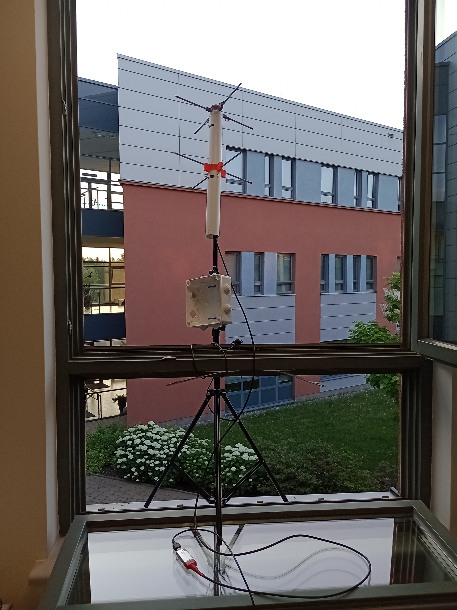
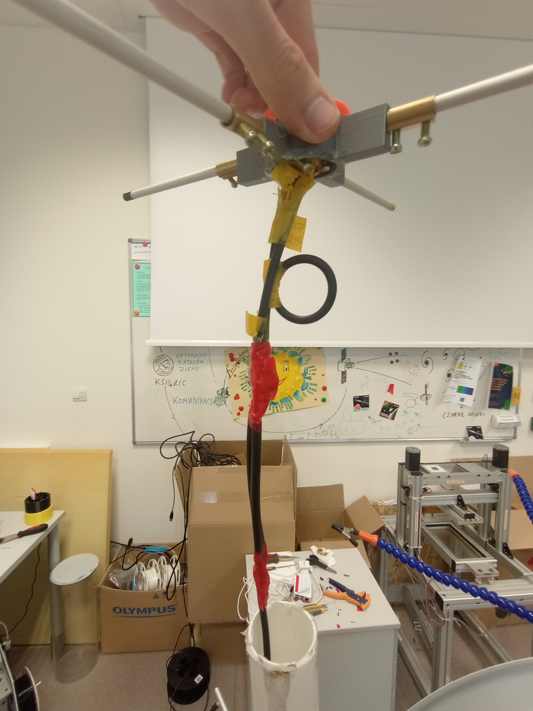
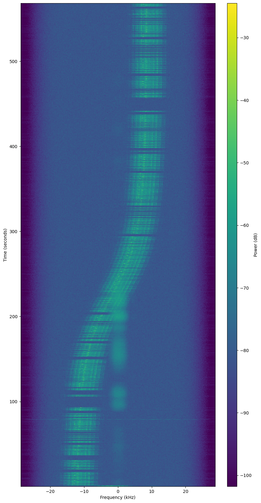
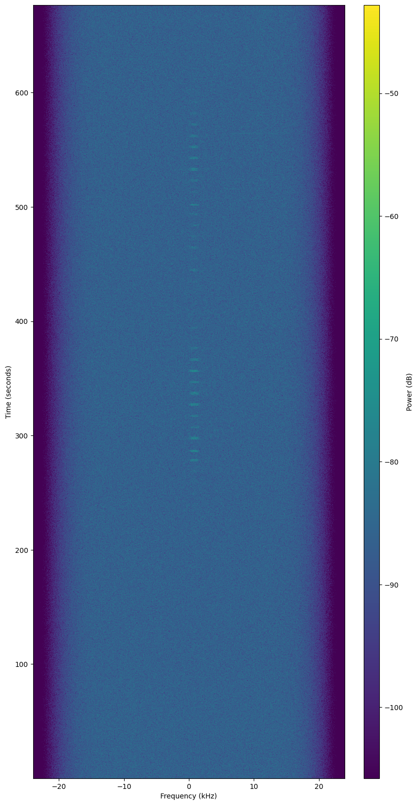

# JU SatNOGS station

## Authors

- Mateusz Winiarski

## Description of the project

[**SatNOGS**](https://satnogs.org) (Satellite Networked Open Ground Station) is a open-source project consisting of network of satellite ground stations and a platform. Its goal is to track and monitor satellites around the world using multiple stations and make the gathered data publicly accessible.

Our goal was to create our own satellite ground station and to connect it to the SatNOGS observation network. For this purpose we created a station using a turnstile antenna connected to Raspberry Pi microcomputer.

## Science and tech used

Materials used:

- turnstile antenna – 1
  - PCV pipe – 2
    - 25.8 cm (3/8 λ) – 1
    - as long as you need – 1
  - aluminum rods – 6 
    - 16.35 cm (~1/4 λ) – 4
    - 34.4 cm (1/2 λ) –
  - 3d printed rods holders – 2
  - coaxial cable – 5
    - 75 Ω cable – 2
      - 11.35 cm (1/4 λ) – 2
    - 50 Ω cable – 3
      - 11.35 cm (1/4 λ) – 1
      - 22.7 cm (1/2 λ) – 1
      - as long as you need – 1
  - hot gun glue – a lot
  - insulating tape – a lot
- RTL-SDR dongle – 1
- Raspberry Pi with SatNOGS OS – 1
- time – too much
- determination – adequately

Note that wavelengths were multiplied by velocity factor of given material. Full assembly tutorial can be found on [Alicja Musiał's blog](https://alicja.space/blog/how-to-build-turnstile-antenna/).

## State of the art

The station is working as expected and is returning quite good observation. Temporarily, the antenna is mounted outside the window of Garage.

||  |
| :--: | :--: |
| *The antenna with RTL-SDR dongle just outside the Garage's window* | *Interior of antenna* |

You can see last observations and current status of station on [its page in SatNOGS network](https://network.satnogs.org/stations/2909/).

| image          |  |  |  |  |
|----------------|---------------------------------------------------------|---------------------------------------------------------|---------------------------------------------------------|---------------------------------------------------------|
| observation id/link | [7807309](https://network.satnogs.org/observations/7807309/)                                                 | [7818544](https://network.satnogs.org/observations/7818544/)                                                 | [7819234](https://network.satnogs.org/observations/7819234/)                                                 | [7819260](https://network.satnogs.org/observations/7819260/)                                                 |
| satellite | [2021-091H](https://db.satnogs.org/satellite/49322) | [NEXUS](https://db.satnogs.org/satellite/43937) | [ISS](https://db.satnogs.org/satellite/25544) | [DhabiSat](https://db.satnogs.org/satellite/49016) |
| transmitter mode | BPSK 4800 | CW Beacon | V/U FM | BPSK 1200

*Sample observation waterfalls of the station with different satellites and dirrerent transmitter modes. Note that tangent-like lines are terrestrial noise*

## What next?

Next step is, after making sure that antenna is working correctly and mounting it on the roof, to make the station available for everyone to schedule observations.

## Operation guide

To make an observation you have to:

1. Log in to [network.satnogs.org](https://network.satnogs.org) using Garage's credentials.
1. Go to [station page](https://network.satnogs.org/stations/2909/) and check if it is in *Online* or *Testing* mode.
1. Open *Future passes* tab and mark passes you want to observe (you can filter by success rate and max elevation in *filters*, I advise to set minimal max elevation to 45 degrees while the antenna is mounted on the window). Note that you can only set observations since 10 minutes from now.
1. Confirm pass observation in opened card. If you set multiple observations, pay attention to overlapping.

## Sources

<!--- [Writing on GitHub]( https://docs.github.com/en/get-started/writing-on-github )-->
- [How to build a turnstile antenna for 435Mhz (and connect it to SatNOGS network) - tutorial for beginners](https://alicja.space/blog/how-to-build-turnstile-antenna/)
- SatNOGS Wiki:
  - [Omnidirectional Station How To](https://wiki.satnogs.org/Omnidirectional_Station_How_To)
  - [Raspberry Pi](https://wiki.satnogs.org/Raspberry_Pi)
  - [SatNOGS Client Setup](https://wiki.satnogs.org/SatNOGS_Client_Setup)
  - [SatNOGS Monitor](https://wiki.satnogs.org/SatNOGS_Monitor)
  - [Operation](https://wiki.satnogs.org/Operation)
- [RTL-SDR Quick Start Guide](https://www.rtl-sdr.com/rtl-sdr-quick-start-guide/)
